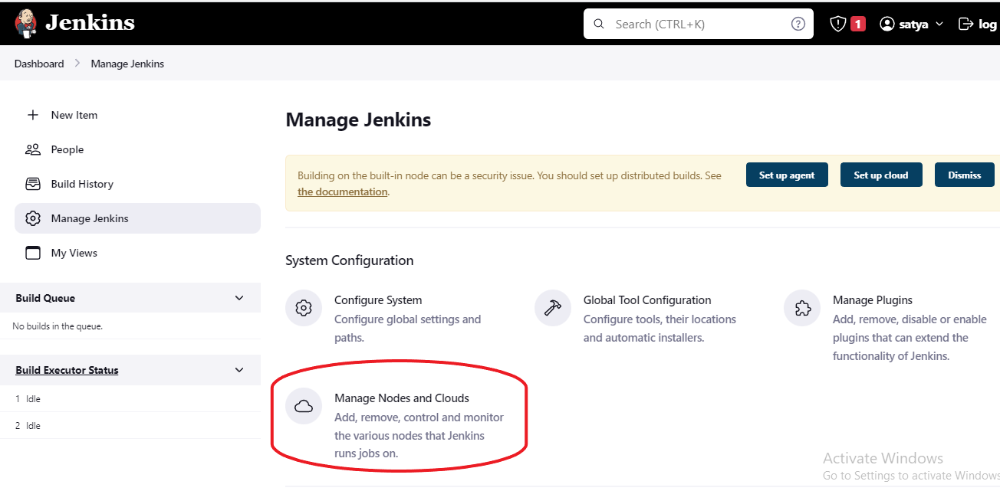

#  *JENKINNS - ANSIBLE - INTEGRATION* 

*** 
##  *steps to follow*
---
1. First thing to do is ansible master-node configurationAnsible
   ---

   1. Take an ec2 instance and make it as ansible master by followiing below steps.
   2. after log into your virtual machine, create a user with password and enable password authentication to the user.
      ```
      $ sudo apt update
      $ sudo adduser <user-name>

      ```
      
   3. give sudo privileges to the user.
      ```
      $ sudo vi /etc/sudoers

      ```
      

   4. enabling password authentication.
      ```
      $ sudo vi /etc/ssh/sshd_config

      ```
      
   5. restart sshd service
      ```
      $ sudo systemctl restart sshd

      ```
   6. Repeat all the above steps in ansible node vm .
   7. Now login to the user in ansible master with password.
      ```
      $ ssh <username>@publicIP

      ``` 
      
      It asks for password.enter  there.
   8. after successful login using password you see this.
        
   9. now create rsa key.
      ```
      $ ssh-keygen
      
      ```
      
   10. now copy this RSA key to ansible node.
       ```
       $ ssh-copy-id <ansible-node-user-name>@<ansible-node-ip>
       
       ```
       it request for password.
         
   11. After successful key sharing. we will see this message.
       
   12. Now try to login to ansible node.
       ```
       $  ssh <ansible-node-user-name>@<ansible-node-ip>

       ```
       it will login with out asking for password.
       
   13. now install ansible on Ansible master node.
       ```
       $ sudo apt update
       $ sudo apt install software-properties-common
       $ sudo add-apt-repository --yes --update ppa:ansible/ansible
       $ sudo apt install ansible
       $ ansible --version

       ```  
       
   14. Now ping with ansible node.
        
   15. Now install java11 on Ansible master node. 
       ```
        $ sudo apt update
        $ sudo apt install openjdk-11-jdk -y

       ``` 
   16. Now Ansible master node is ready to integrate with Jenkis Master node.  
   
2. Take another EC2 instances
    ---
    1. Do the following configuration.
    2. install java-11
        ```
        $ sudo apt update
        $ sudo apt install openjdk-11-jdk -y

        ```
    3. install jenkins
        ```
        $ curl -fsSL https://pkg.jenkins.io/debian-stable/jenkins.io.key | sudo tee \
          /usr/share/keyrings/jenkins-keyring.asc > /dev/null
        
        $ echo deb [signed-by=/usr/share/keyrings/jenkins-keyring.asc] \
          https://pkg.jenkins.io/debian-stable binary/ | sudo tee \
          /etc/apt/sources.list.d/jenkins.list > /dev/null
        
        $ sudo apt-get update

        $ sudo apt-get install jenkins -y

        ```
    4. Now give sudo permission to jenkins.
       ```
        $ sudo vi /etc/sudoers

       ```
       

    5. Now open jenkins UI in browser.
        ```
        http://<publicIP>:8080
        ```
        

    6. Now we have to unlock jenkins.
    7. you will find initial password here
        
       
       ```
       $ sudo vi /var/lib/jenkins/secrets/initialAdminPassword

       ```
       
    8. now enter initial password in jenkins ui.
        
    9. click on install suggested plugins.
        
    10. create Admin user 
        
    11. click start using Jeninks
        
    12. After sucessfull login.  you get this page.
        
    13. For making Node configuration follow the below steps.
        * click on > manage jenkins
          
        * click on > Manage Nodes and Clouds
           
        * click on > New Node
          
        * enter node name , select permanent Agent and click on create button.
          
        * fill the following configuration details
          
          
          for adding credentials do follow the steps.
          
          
        * After successful node configuration you will find node here.
          
        * Now creating Declarative pipeline to install apache through Ansible play book.
        * for declarative pipeline, playbook and hosts file refer the git repository.[link](https://github.com/My-revision-aws-devops/jenkins-ansible-intigration.git)
        * Follow the below steps
          
          
          
          
          
          
